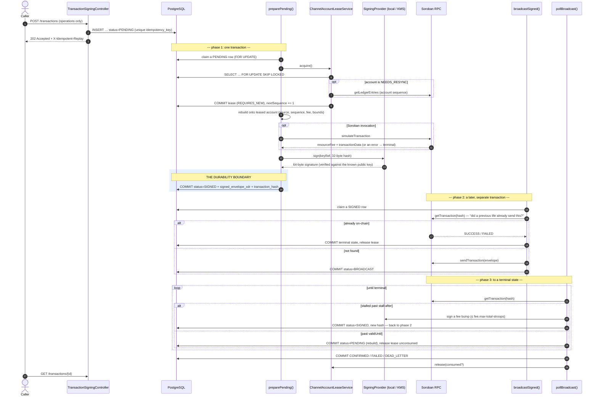

# Stellar Key Custody & Transaction Signing Service

Implements [#40](https://github.com/workman-labs/guildworkman-core/issues/40):
server-side signing and submission of Stellar/Soroban transactions, with a
custody abstraction that keeps secret keys out of this process in production,
concurrency-safe sequence-number allocation, and submission tracking that
survives a restart without double-submitting.

The short version of what this changes for callers: previously they had to
build **and sign** a transaction themselves and hand us the finished envelope
(`POST /api/v1/escrow/orchestrations`, issue #21). Now they can hand us the
*operations* and nothing else — no source account, no sequence number, no fee,
no key — and the service does the rest.

## New dependencies

One: **`network.lightsail:stellar-sdk:3.1.0`**.

This reverses decision 1 of
[`ESCROW_ORCHESTRATION.md`](ESCROW_ORCHESTRATION.md), which said no Java
Stellar/Soroban SDK existed on Maven Central and therefore relayed
already-signed envelopes as opaque strings. That was accurate about the
*official* SDK — `stellar/java-stellar-sdk` was archived by SDF — but
incomplete: `network.lightsail:stellar-sdk` is its actively maintained
successor, published to Maven Central, targeting Java 8+ bytecode, and
depending only on things this project already has or can carry (OkHttp 4.12,
Gson, Bouncy Castle, commons-codec).

The reversal isn't optional for this feature. Every one of the issue's
acceptance criteria needs real XDR:

| Requirement | XDR it needs |
|---|---|
| Set the sequence number on a transaction | Build and re-encode a `TransactionEnvelope` |
| Sign with a key we hold | Compute the transaction hash over the network passphrase |
| Fee-bump a stalled transaction | Wrap an envelope in a `FeeBumpTransaction` |
| Distinguish `tx_bad_seq` from `tx_insufficient_fee` | Decode `TransactionResult` |
| Read a channel account's real sequence | Encode a `LedgerKey`, decode a `LedgerEntry` |

Hand-rolling that binary encoding was the thing decision 1 (rightly) refused to
do. With a maintained SDK available, the trade-off it was weighing no longer
holds.

`SorobanRpcClient` keeps its old behaviour everywhere it can: envelopes,
hashes and result blobs still pass through `sendTransaction` /
`getTransaction` / `simulateTransaction` as opaque strings. The single place
it now decodes XDR is `getAccountSequence`, because a ledger entry can only be
*addressed* by an XDR `LedgerKey` and only read back out of XDR — there is no
string-shaped alternative.

## Schema / migrations

No migration file, for the same reason as every other table here: this
codebase has no Flyway/Liquibase and manages schema through Hibernate's
`spring.jpa.hibernate.ddl-auto=update`, with the entity classes as the source
of truth. Two new tables:

- **`stellar_channel_accounts`** (`ChannelAccount.java`) — the pool. Unique on
  `account_id` and on `key_ref`, indexed on `status`.
- **`stellar_transaction_submissions`** (`TransactionSubmission.java`) — one
  row per logical submission. Unique on `idempotency_key`; indexed on
  `(status, next_attempt_at)` for the worker claim query, on
  `transaction_hash`, and on `reference`.

Both tables are new, so `ddl-auto=update` simply creates them on first deploy
and no-ops thereafter; there is no existing column or data they could conflict
with. The known limitation of this approach — it cannot express a safe rename
or type change — is unchanged and app-wide, not specific to this feature.

**The XDR columns are `text`, not `@Lob`.** Worth stating because the obvious
annotation is the wrong one here. Hibernate maps `@Lob String` onto a
PostgreSQL `oid`, a pointer into `pg_largeobject`, and large objects are *not*
removed when the row referencing them is deleted — a service submitting
transactions continuously would leak one per submission, unbounded and
unreclaimable by `VACUUM`. They also can only be read inside an open
transaction, so any read outside one fails at runtime with "Unable to access
lob stream". `text` is unbounded in PostgreSQL and has neither problem.
(`EscrowOrchestrationRequest.signedTransactionXdr` from #21 still uses `@Lob`
and has the same latent leak; changing it means altering a deployed column's
type, which `ddl-auto=update` can't do safely, so it belongs in its own PR —
noted under [Follow-ups](#follow-ups-out-of-scope-for-this-pr).)

## Key material

This is the part worth reading closely, since the failure mode is
unrecoverable: a leaked Stellar secret seed is a drained account.

- **`SigningProvider` has no method that can return a key.** `providerId`,
  `supports`, `publicKey`, `sign` — that's the whole interface. There is no
  `secretSeed()` to accidentally call, log, or serialize.
  `SigningProviderShapeTest` pins that method set by reflection *and* checks
  both implementations for any public member that returns key material or is
  merely named as though it might (`secret`, `seed`, `private`, `keypair`), for
  any public instance field, and for a missing `toString()` override. A getter
  added in six months fails the build with a message saying why, rather than
  passing review as an innocuous accessor.
- **A provider will only sign a 32-byte transaction hash.** An Ed25519 key that
  signs whatever it is handed is a signing oracle; constraining the input
  doesn't prove the bytes are *our* hash, but it removes the case where a whole
  envelope, a concatenation, or an attacker-chosen payload reaches a key. The
  KMS provider checks before it resolves the key, so an oversized payload never
  produces a request either.
- **The KMS gateway must be `https` and authenticated,** enforced at startup
  rather than left to deployment convention. In cleartext the bearer credential
  is readable and — worse — a response is *modifiable*, and a substituted
  response is a substituted signature. Loopback is the one exemption, for tests
  and for a sidecar-terminated proxy where there is no network path to observe.
- **In production the key is never in this process.** With
  `stellar.signing.provider=kms`, `KmsSigningProvider` sends the 32-byte
  transaction hash to a gateway and receives a signature. Nothing else crosses
  the wire, and the gateway contract is two endpoints of plain JSON, so it can
  front AWS KMS, GCP KMS, Vault Transit or an HSM without this class changing.
- **Every returned signature is verified** against the key reference's known
  public key before use. A gateway signing with the wrong key fails here,
  loudly, instead of surfacing seconds later as an opaque `txBAD_AUTH` that has
  already cost a sequence number.
- **In development the seed never leaves `KeyPair`.** `LocalSigningProvider`
  parses configured seeds once at startup and holds only `KeyPair` instances.
  A bad seed fails startup with a message naming *only the key reference*, and
  the parse exception's cause is dropped deliberately — strkey parsers
  habitually quote the input that broke them.
- **Nothing is registered or submitted using key material.** Channel accounts
  are registered by *reference*; the account id is derived from custody. A
  Stellar seed is 56 characters of letters and digits, which is exactly the
  shape of a plausible alias, so the request DTOs carry an explicit
  negative-lookahead pattern rejecting anything seed-shaped — a fat-fingered
  paste is a `400`, not a secret in a database column and an access log.
- **`SecretRedactor` is the backstop.** Every string persisted to `last_error`
  or written to a log passes through it. It replaces full-width `S…` strkeys
  only: account ids (`G…`), contract ids (`C…`) and muxed accounts (`M…`) share
  the alphabet but not the version character and are left intact, because
  redacting them would blind operators to the identifiers they diagnose with.
- **Secrets are confined to holder classes with overridden `toString()`** —
  `SigningProperties.Local` prints key *names* only, `SigningProperties.Kms`
  masks the API key — so a stray `log.debug("{}", props)` can't leak them.
- **No response body contains an envelope.** `TransactionSubmissionResponse`
  exposes public chain data (accounts, sequence, fee, hashes, ledger) and our
  own bookkeeping. The signed envelope, which carries signatures, is not in it.
  Belt and braces on the entity behind it: `signed_envelope_xdr`,
  `unsigned_transaction_xdr` and `result_xdr` are `@JsonIgnore`d and both
  entities have hand-written `toString()`s rendering identifiers only — so the
  day someone returns an entity straight from a controller, or interpolates one
  into a log line, signatures don't ride along. (A Lombok `@ToString` would
  have picked the envelope columns up silently; that's why these are written
  out by hand.)
- **Nothing here is logged, at any level.** `LocalSigningProviderTest` and
  `KmsSigningProviderTest` drive the whole lifecycle — load, resolve, sign,
  render, and the *failure* paths, where an exception message is the likeliest
  leak — with a capturing appender on the **root** logger at `TRACE`, then
  assert the seed and the API key appear nowhere in the output. Root, not the
  class's own logger, because a leak via a library or a stack trace is still a
  leak; `TRACE`, because production log levels are a deployment setting, not a
  security control.

## Architecture decisions

1. **Sequence numbers come from a leased pool of channel accounts, not from a
   counter.** Stellar validates a transaction's sequence number as *exactly*
   the source account's current sequence plus one. Handing out `n` and `n+1`
   concurrently on one account parallelises nothing: the network takes
   whichever arrives first and rejects the other with `txBAD_SEQ`. Real
   concurrency has to come from having more accounts. So
   `ChannelAccountLeaseService.acquire` claims one free account with
   `SELECT … FOR UPDATE SKIP LOCKED` (Hibernate's `-2` lock timeout hint),
   allocates its next sequence, and marks it `LEASED` — N concurrent
   submissions therefore get N distinct accounts and N distinct sequence
   numbers, with no coordination beyond the database.
   `ChannelAccountLeaseIntegrationTest` proves exactly that against real
   PostgreSQL, with a `CyclicBarrier` so the threads genuinely contend.

2. **`SKIP LOCKED` for channel accounts, plain `FOR UPDATE` for submissions.**
   They're different questions. "Give me *any* free account" is what
   `SKIP LOCKED` is for — a locked row is simply not the one you want, so
   skipping it is free parallelism. "Give me *this* submission row" can't skip
   anything; two workers reaching the same row must serialise, which plain
   `FOR UPDATE` does. Using `SKIP LOCKED` there would silently drop work.

3. **A lease is only released as `AVAILABLE` if the transaction reached a
   ledger.** This is the subtlest correctness property in the feature. A
   sequence number allocated to a transaction that never lands is *skipped*,
   and every later transaction from that account would then be rejected — the
   local counter has run ahead of the chain. So confirmation *and* on-chain
   failure both release to `AVAILABLE` (both spend the number), while anything
   that never landed — a fee ceiling hit, lapsed time bounds, a dead-lettered
   row — releases to `NEEDS_RESYNC`, and the next lease re-reads the account's
   real sequence from the network first. That single rule is what stops one
   lost transaction from poisoning an account permanently.

4. **The service rebuilds the caller's operations rather than relaying their
   envelope.** Signing commits to source account, sequence, fee *and* time
   bounds — all four live inside the signed payload. A service that accepts
   pre-signed envelopes (as #21 does) therefore has exactly one recovery move
   available: send the same bytes again. Keeping only the caller's
   *operations* is what makes every recovery path below possible. The caller's
   own source/sequence/fee/time-bounds are placeholders and are always
   replaced; preconditions beyond time bounds (minimum sequence age, ledger
   bounds, extra signers) are **rejected** rather than silently dropped, since
   they constrain precisely the fields this service owns.

5. **The envelope is durable before it is broadcast, never after.** That
   ordering is the restart-safety trick. A process that dies anywhere in the
   broadcast phase comes back holding the exact hash it may have sent, and the
   phase *begins* by asking the network about that hash rather than signing
   something new. Even a genuine resend can't double-execute — identical bytes
   have an identical hash, which Soroban RPC answers with `DUPLICATE` — but the
   pre-check adds correct accounting: a transaction that landed while we were
   away is recognised as confirmed rather than re-sent and re-polled.

6. **Each failure code gets the recovery it actually needs.** Treating a
   rejection as an opaque "it failed" produces the two classic bugs this
   feature exists to avoid. `FailureClassifier` decodes the
   `TransactionResult`:

   | Result code | Reason | What happens |
   |---|---|---|
   | `txBAD_SEQ` | `BAD_SEQUENCE` | Release for resync, rebuild — retrying unchanged would reproduce it forever |
   | `txINSUFFICIENT_FEE` | `INSUFFICIENT_FEE` | Fee-bump — failing here would throw away a landable transaction |
   | `txTOO_LATE` / `txTOO_EARLY` | `TOO_LATE` | Rebuild with fresh time bounds |
   | `txMALFORMED`, `txMISSING_OPERATION`, `txSOROBAN_INVALID`, `txNOT_SUPPORTED` | `MALFORMED` | Terminal |
   | `txBAD_AUTH`, `txBAD_AUTH_EXTRA` | `BAD_AUTH` | Terminal |
   | `txINSUFFICIENT_BALANCE`, `txNO_ACCOUNT` | `INSUFFICIENT_BALANCE` | Terminal — an operator has to fund the account |
   | `txFAILED` | `ON_CHAIN_FAILED` | Terminal, sequence consumed |
   | anything undecodable | `UNKNOWN` | Bounded retries — a future protocol code shouldn't crash a worker |

7. **Soroban invocations are simulated before they're signed.** A contract call
   simulation says cannot succeed is failed terminally with
   `SIMULATION_FAILED`. Submitting it anyway would burn a fee and a sequence
   number to learn what simulation just reported for free. Simulation also
   supplies the `SorobanTransactionData` the transaction needs, and its
   resource fee is what the builder adds on top of the inclusion fee — which is
   why the final fee is read back off the built transaction rather than
   computed.

8. **The fee ceiling is ours to enforce.** `FeeBumpTransaction.createWithFee`
   performs no validation whatsoever — `TransactionAssemblerTest` pins that
   behaviour, including that it will happily accept a fee *lower* than the
   inner transaction's. So `stellar.signing.fee.max-total-stroops` is checked
   twice in our code: before signing, and before every bump.

9. **Three workers, not one.** Prepare, broadcast and confirm each claim their
   own rows with their own backoff, so a slow ledger never blocks new signing
   and a signing outage never blocks confirmations. Same claim-one-row-per-tick
   shape as `EscrowOrchestrationService`, which also naturally throttles how
   many requests hit an unhealthy RPC endpoint at once.

## The pipeline, and where it becomes durable

The one ordering rule everything else rests on: **the envelope is on disk
before it is on the network.** Phase 1 ends by committing the signed envelope
and its hash; phase 2 begins, in a *separate* transaction, by asking the
network about that hash. Nothing in between.

Read the boundary backwards to see what it buys. A process that dies anywhere
in phase 2 comes back holding the exact hash it *may* have sent, and phase 2
starts by asking about that hash — so "did we broadcast this?" is a question
with an answer rather than a guess. Invert the ordering and the same crash
produces a service with no record of a transaction the network has, which then
signs a second one on a second sequence number and executes the caller's
operations twice.

A genuine resend is harmless on top of that: the same envelope has the same
hash, so Soroban RPC answers `DUPLICATE` rather than executing it again. The
pre-check isn't what makes resending safe — it's what makes the *accounting*
right, recognising a transaction that landed while we were away instead of
re-sending and re-polling it.

Pinned by `TransactionSubmissionIntegrationTest`
`#theEnvelopeIsCommittedBeforeAnythingIsEverBroadcast` (the row is committed,
the RPC client is untouched during phase 1, and phase 2's first call is
`getTransaction`) and
`#aSignedRowLeftBehindByACrashedProcessIsAskedAboutBeforeItIsResent`.

## Why this always terminates

Worth stating explicitly, because "retry until it lands" is exactly how a
signing service ends up either spending unbounded fees or polling a dead
transaction forever. Three bounds, and every path hits one of them:

- **Fee bumps are bounded by the ceiling.** Each bump multiplies the fee
  (default ×2); the first that would cross `fee.max-total-stroops` fails the
  submission with `FEE_CEILING_REACHED` instead. Stalling is a bounded state,
  not an open-ended one.
- **A lapsed transaction is rebuilt, not polled.** Past its `maxTime` the
  network can never include it, so there is no verdict left to wait for.
- **Rebuilds and retries are bounded by `retry.max-attempts`,** after which the
  row moves to `DEAD_LETTER` for an operator.
- **A crashed holder's lease expires.** `sweepExpiredLeases` reclaims it —
  but conservatively: a lease whose submission is still non-terminal has its
  TTL extended rather than reclaimed, because that transaction may be in the
  mempool right now and reusing its sequence number would race it. Only an
  orphan (the process died between committing the lease and committing the
  submission) is reclaimed, always to `NEEDS_RESYNC`.

## Retry, backoff & observability

- **Capped exponential backoff with jitter**, identical in shape to
  `escrow.orchestration.retry.*`: doubling from `base-delay`, capped at
  `max-delay`, randomised by ± `jitter`. A batch of submissions that failed
  together (an RPC outage) must not come back in lockstep and reproduce it.
- **Every state transition is logged with the submission id** and, once
  signed, the transaction hash — so one submission's whole life is greppable.
  Fee bumps log both hashes, since after a bump either may be the one that
  lands.
- **Log levels follow expectedness, not severity of wording.** Terminal
  failures are `WARN` (an operator wants to see them), rebuilds and retries are
  `INFO`, and `NO_CHANNEL_ACCOUNT` is `DEBUG` — under load it is the pool doing
  its job, and at `INFO` it would drown out everything else. Lease claims and
  releases are `DEBUG` with the account, its status transition and its
  sequence, which is the detail you want when reconstructing a `txBAD_SEQ`
  after the fact.
- **No circuit breaker.** Same reasoning as `ESCROW_ORCHESTRATION.md`: there is
  no Resilience4j in this codebase and adding one is a cross-cutting choice
  that deserves its own PR. What bounds the damage meanwhile: per-call HTTP
  timeouts, bounded attempts into `DEAD_LETTER`, and one-row-per-tick claiming.

### Metrics

Micrometer counters, scraped from `/actuator/prometheus` (this PR adds
`spring-boot-starter-actuator` and `micrometer-registry-prometheus`). They
exist because the interesting failures here are the quiet ones: a
dead-lettered submission and a stalled one look identical from outside — in
both cases, nothing happens.

| Meter | Tags | What a change in it means |
|---|---|---|
| `stellar_signing_submissions_total` | `outcome=created\|replayed` | Offered load, and how much of it is duplicate |
| `stellar_signing_phase_attempts_total` | `phase=prepare\|broadcast\|poll` | Which phase the pipeline is spending itself on |
| `stellar_signing_fee_bumps_total` | — | Network congestion — and an early warning that the ceiling is about to bite |
| `stellar_signing_terminal_total` | `status`, `reason` | The alerting series. A rising `SIGNING_FAILED` is a custody outage; `NO_CHANNEL_ACCOUNT`, a pool that needs more accounts; `DEAD_LETTER`, work that needs a human |
| `stellar_signing_leases_total` | `event=ACQUIRED\|RELEASED_CONSUMED\|RELEASED_NEEDS_RESYNC\|RECLAIMED\|EXTENDED\|RESYNCED` | `RECLAIMED` above zero means processes are dying mid-submission |

Two deliberate choices. **Tag values are a closed set** — enum names and a
fixed vocabulary of phases — so series cardinality is bounded by the code
rather than by traffic; nothing caller-supplied (idempotency key, reference,
account) is ever a tag, and a test asserts it. And **the actuator endpoints are
authenticated**: only `health`, `info` and `prometheus` are exposed, none is in
`SecurityConfig`'s `PUBLIC_ENDPOINTS`, so a scraper needs a bearer token or an
in-cluster network policy. The tags name failure reasons and pipeline phases,
which is more than an anonymous reader should get.

## API behavior

- **`POST /api/v1/stellar/transactions` always returns `202 Accepted`.**
  Signing needs a channel account, simulation needs a network round-trip, and
  inclusion needs a ledger to close; none of that fits inside a request.
  Callers poll `GET /{id}`, or look submissions up by their own `reference`.
- **Idempotent on `idempotencyKey`**, with `X-Idempotent-Replay: true|false`
  telling you which case happened — the same contract the escrow endpoints
  use, and for a sharper reason here: a duplicate wouldn't merely duplicate
  bookkeeping, it would lease a second account, consume a second sequence
  number and put a second transaction on-chain for one logical request.
- **Envelope and key-reference validation happen synchronously**, on the
  caller's own request, so a malformed envelope or an unknown key reference is
  a `400` they can act on rather than a dead-lettered row nobody is watching.
- **Errors are RFC 7807 `application/problem+json`**, via the existing
  `GlobalExceptionHandler` — no new error contract. `SigningProviderException`
  is deliberately answered with a fixed detail string: the exception already
  redacts itself, and this is a second guarantee that nothing from the signing
  path reaches a client body.
- **`GET /{id}` reports current state, not an audit log.** Per-attempt detail
  lives in application logs, correlated by submission id.

## Operations

- **Sizing the pool.** The pool size *is* the concurrency limit: one in-flight
  transaction per account. `GET /api/v1/stellar/channel-accounts` is the health
  view — a pool where every member is `LEASED` is about to start answering
  `503 no-channel-account-available`. Every account must be funded on-chain
  before it can be leased; an unfunded one is refused with a message saying so.
- **Adding an account** is `POST /api/v1/stellar/channel-accounts` with a key
  reference. The account id is derived through custody, so an account this
  deployment can't sign for cannot be added. It starts `NEEDS_RESYNC` and its
  sequence is read from the network on first use, which keeps registration free
  of RPC dependencies.
- **Rotating one out**: `POST /{id}/disable`. Refused with `409` while the
  account is leased — disabling mid-transaction would strand its sequence
  number. `POST /{id}/enable` returns it as `NEEDS_RESYNC`, never straight to
  `AVAILABLE`.
- **`POST /{id}/resync`** is the manual escape hatch for an account whose
  cached sequence has drifted, typically because something outside this service
  also used it. The service does this by itself after any failure that implies
  drift; the endpoint is for the cases an operator spots first. Also refused
  while leased: mid-lease the chain still reports the sequence *before* the
  in-flight transaction, so writing it back would hand the next lease a number
  already in use.
- **A `DEAD_LETTER` row needs a human.** It has exhausted its attempts; its
  channel account has already been released for resync, so the pool is not
  stuck. Read `last_error` and `failure_reason`, fix the cause, and resubmit
  under a new idempotency key.
- **Switching to KMS** is configuration only: set
  `stellar.signing.provider=kms` plus the gateway URL and token, and unset the
  local seeds. The two providers are interchangeable behind `SigningProvider`
  precisely so this is not a code change.

## Operator runbook

The pause lever first, since several of the procedures below use it:

**`stellar.signing.enabled=false` stops the workers.** Signing, broadcasting
and polling all halt; the API keeps accepting submissions and they queue as
`PENDING`. This is safe at any point precisely because every phase transition
is already durable — pausing changes no state at all, and resuming picks up
from the rows exactly where they were. In-flight transactions keep their
channel accounts (the sweeper extends rather than reclaims a lease whose
submission is still live), so nothing is handed a sequence number that is
already in the mempool. Verified by
`TransactionSubmissionIntegrationTest#pausingStopsTheWorkersWithoutLosingOrDuplicatingWork`.

### (a) A lease that won't clear

**Looks like:** `503 no-channel-account-available` on submissions;
`GET /api/v1/stellar/channel-accounts` shows members `LEASED` for longer than
`lease-ttl`; `stellar_signing_leases_total{event="EXTENDED"}` climbing.

**What's happening:** `sweepExpiredLeases` is deliberately conservative — it
*extends* rather than reclaims any lease whose submission is still
non-terminal, because that transaction may be in the mempool right now and
reusing its sequence number would race it. So a lease that never clears means
its **submission** is stuck, not the sweeper.

1. Find the holder: `leased_by_submission_id` on the account row, then look up
   that submission's `status`, `failure_reason` and `last_error`.
2. **`BROADCAST` and the transaction is genuinely unknown to the network** —
   it will time out at `valid_until` on its own and rebuild. Wait rather than
   intervene; the bound is `transaction-timeout` (default 120s).
3. **`PENDING`/`SIGNED` and not advancing** — the workers are stopped
   (`stellar.signing.enabled=false`?) or the phase is failing. Check
   `stellar_signing_phase_attempts_total` for movement.
4. **Genuinely orphaned** (no submission row at all — a process died between
   committing the lease and committing the submission): the sweeper reclaims
   it to `NEEDS_RESYNC` within `lease-ttl`. To reclaim it sooner, lower
   `stellar.signing.lease-ttl`; the sweep runs every
   `stellar.signing.lease-sweep-delay-ms`.
5. **Never** clear a lease by hand while its submission is non-terminal. The
   next lease would reuse the sequence number and, if the original does land,
   both transactions can't — one of them fails `txBAD_SEQ` and which one is a
   race.

**To buy headroom now:** register more channel accounts
(`POST /api/v1/stellar/channel-accounts`). Pool size *is* the concurrency
limit, and adding to it is online and reversible.

### (b) `FEE_CEILING_REACHED`

**Looks like:** submissions terminal with `failure_reason=FEE_CEILING_REACHED`;
`stellar_signing_fee_bumps_total` rising beforehand.

This is the ceiling working, not a fault: the transaction stalled, each bump
doubled the fee, and the next one would have crossed
`stellar.signing.fee.max-total-stroops`. The service stopped instead of
spending more.

1. **Decide whether the transaction still matters.** Its sequence number was
   released unconsumed and the account resynced, so the pool is not stuck. The
   operations were never executed.
2. **If the network is congested and the work is worth more than the ceiling:**
   raise `stellar.signing.fee.max-total-stroops` and resubmit under a **new
   idempotency key** (the old row is terminal by design). The ceiling is a
   per-transaction cap, so raising it raises the worst case for every
   transaction — treat it as a spending decision.
3. **If it fired on a Soroban invocation immediately, before any bump:** that
   is a large *resource* fee from simulation, not congestion. The ceiling is
   doing exactly its job — a footprint that big is usually the contract call,
   not the network.
4. **Do not** work around it by disabling the bump. A transaction that can't
   outbid the mempool doesn't land; it just occupies a channel account until
   its time bounds lapse.

Startup validation refuses a ceiling below `fee.base-stroops` outright — that
misconfiguration would fail every transaction before it was ever signed, which
looks like a Stellar outage rather than a config typo.

### (c) KMS connectivity lost

**Looks like:** submissions retrying with `failure_reason=SIGNING_FAILED`,
`503 signing-unavailable` on synchronous key-reference validation, and
`stellar_signing_terminal_total{reason="SIGNING_FAILED"}` rising as attempts
run out into `DEAD_LETTER`.

The signing path is already fail-safe: no key material is cached, nothing is
signed with a stale key, and a submission that can't be signed is retried and
then dead-lettered rather than broadcast half-formed.

1. **Bound the blast radius first:** `stellar.signing.enabled=false`. Work
   queues as `PENDING` instead of burning its `retry.max-attempts` (default 5)
   against a gateway that is down and landing in `DEAD_LETTER`, which needs a
   human per row. This is the main reason the pause lever exists.
2. Check gateway reachability and the credential. Signing requests carry a
   32-byte hash and a bearer token; the provider refuses at startup to talk to
   a non-`https` gateway (loopback excepted) or one with no API key, so a
   *started* process was configured correctly at boot.
3. If the gateway is up but signatures are being rejected with "unexpected
   key" or "failed verification", **a key rotation is mid-flight.** Public keys
   are cached for the process's lifetime on purpose — silently picking up a new
   public key would invalidate transactions already signed against the old one.
   Complete the rotation, then restart the service.
4. Re-enable with `stellar.signing.enabled=true`. Queued rows resume from where
   they stopped; nothing needs resubmitting.
5. **Emergency fallback to local custody is a real decision, not a quick fix.**
   `provider=local` puts seeds in this process's environment. If you take it,
   treat those seeds as compromised afterwards and rotate the channel accounts
   out.

### Levers, in one place

| Symptom | Lever | Effect |
|---|---|---|
| Anything, urgently | `stellar.signing.enabled=false` | Workers stop; submissions queue; nothing is lost |
| Pool exhausted (`503`) | `POST /channel-accounts` | More concurrency, online |
| Load shedding needed | `stellar.signing.prepare-poll-delay-ms` ↑ | Slower intake per node |
| Orphaned leases held too long | `stellar.signing.lease-ttl` ↓ | Sweeper reclaims sooner (never reclaims a live submission) |
| Congestion, work worth more | `stellar.signing.fee.max-total-stroops` ↑ | Higher per-transaction ceiling |
| Bumping too early/late | `stellar.signing.stall-after` | Keep it comfortably under `transaction-timeout` |
| Gateway flapping | `stellar.signing.retry.max-attempts` ↑ | Fewer rows reach `DEAD_LETTER` |
| Sequence drift on one account | `POST /channel-accounts/{id}/resync` | Re-reads the chain (refused while leased) |

## Endpoints

| Method | Path | Auth | Description |
|---|---|---|---|
| `POST` | `/api/v1/stellar/transactions` | Bearer | Sign and submit a transaction (idempotent; `202`) |
| `GET` | `/api/v1/stellar/transactions/{id}` | Bearer | Fetch a submission's current state |
| `GET` | `/api/v1/stellar/transactions?reference=` | Bearer | Find submissions by the caller's own reference |
| `POST` | `/api/v1/stellar/channel-accounts` | Bearer + ADMIN | Register a channel account by key reference (`201`) |
| `GET` | `/api/v1/stellar/channel-accounts` | Bearer + ADMIN | List the pool with lease state |
| `GET` | `/api/v1/stellar/channel-accounts/{id}` | Bearer + ADMIN | Fetch one pool member |
| `POST` | `/api/v1/stellar/channel-accounts/{id}/disable` | Bearer + ADMIN | Take an account out of the pool |
| `POST` | `/api/v1/stellar/channel-accounts/{id}/enable` | Bearer + ADMIN | Return it as `NEEDS_RESYNC` |
| `POST` | `/api/v1/stellar/channel-accounts/{id}/resync` | Bearer + ADMIN | Re-read its sequence from the network |

All endpoints are documented in OpenAPI (`/swagger-ui.html`) via springdoc
annotations on the controllers.

## Configuration

| Property | Default | Purpose |
|---|---|---|
| `stellar.signing.enabled` | `true` | Master switch for the workers. `false` pauses signing/broadcast/polling; submissions still queue. See [Operator runbook](#operator-runbook) |
| `stellar.signing.provider` | `local` | Active custody backend: `local` or `kms` |
| `stellar.signing.network-passphrase` | `Test SDF Network ; September 2015` | Network the hash is signed over; must match `soroban.rpc.url`'s network |
| `stellar.signing.fee-source-key-ref` | *(empty)* | Key that pays for fee bumps; empty means the channel account pays for its own |
| `stellar.signing.local.keys.<ref>` | — | Development seeds, supplied through the environment. Never committed |
| `stellar.signing.kms.url` | *(empty)* | Signing gateway base URL. Required when `provider=kms` |
| `stellar.signing.kms.api-key` | *(empty)* | Bearer credential for the gateway |
| `stellar.signing.kms.request-timeout` | `PT5S` | Per-call gateway timeout |
| `stellar.signing.transaction-timeout` | `PT120S` | `maxTime` bound written into every built transaction |
| `stellar.signing.stall-after` | `PT30S` | Unconfirmed-in-mempool period before a fee bump. Keep well under `transaction-timeout` |
| `stellar.signing.lease-ttl` | `PT5M` | How long a lease survives without progress — the crash-recovery bound |
| `stellar.signing.lease-sweep-delay-ms` | `30000` | Lease sweeper interval |
| `stellar.signing.fee.base-stroops` | `100` | Inclusion fee per operation (100 is the network minimum) |
| `stellar.signing.fee.max-total-stroops` | `1000000` | Hard ceiling on one transaction's total fee (0.1 XLM) |
| `stellar.signing.fee.bump-multiplier` | `2.0` | Multiplier applied on each fee bump |
| `stellar.signing.retry.max-attempts` | `5` | Attempts before `DEAD_LETTER` |
| `stellar.signing.retry.base-delay` | `PT1S` | Backoff for attempt 1; doubles thereafter |
| `stellar.signing.retry.max-delay` | `PT64S` | Ceiling on the pre-jitter backoff |
| `stellar.signing.retry.jitter` | `0.2` | ± fraction to randomise the backoff by |
| `stellar.signing.prepare-poll-delay-ms` | `1000` | `preparePending()` interval |
| `stellar.signing.broadcast-poll-delay-ms` | `1000` | `broadcastSigned()` interval |
| `stellar.signing.confirm-poll-delay-ms` | `1000` | `pollBroadcast()` interval |

| `management.endpoints.web.exposure.include` | `health,info,prometheus` | Actuator surface. Authenticated — see [Metrics](#metrics) |

Environment-variable names for all of these are in
[`.env.example`](../.env.example).

**These are validated at startup** (`SigningProperties#validate`), and a bad
value fails the boot rather than every transaction. The fee bounds are the
reason: a `max-total-stroops` below `base-stroops` makes every transaction fail
`FEE_CEILING_REACHED` before it is even signed, and a `bump-multiplier` of
`1.0` turns fee bumps into a loop that burns attempts without outbidding
anything. Both are one typo away, and both would first surface as "Stellar is
broken", at the exact moment a transaction needed to go out. Also checked:
provider is `local`/`kms`, the network passphrase is set, `max-attempts ≥ 1`,
`max-delay ≥ base-delay`, `jitter ∈ [0, 1)`, and every duration is positive.

## Tests

`./mvnw verify` runs everything. The ones worth knowing about:

- **`ChannelAccountLeaseIntegrationTest`** — the acceptance criterion, against
  real PostgreSQL: 8 threads released simultaneously by a `CyclicBarrier` get 8
  distinct accounts and 8 distinct sequence numbers; an exhausted pool refuses
  the surplus rather than reusing an account. Then the recovery chain end to
  end — a crashed holder → lease expiry → sweep to `NEEDS_RESYNC` → the next
  lease **re-reading the chain before allocating**, asserted by moving the
  chain's sequence between the two leases so a skipped resync fails on the
  number rather than passing on a plausible one. Plus the negative
  (`aConsumedReleaseCostsNoNetworkRoundTrip`: a landed transaction must *not*
  cost a resync) and the sweeper's conservative half. An in-memory database
  would test nothing here — `SKIP LOCKED` is the mechanism under test.
- **`TransactionSubmissionIntegrationTest`** — the pipeline, phase by phase,
  with the RPC stubbed: the happy path (including verifying that the persisted
  envelope really carries the leased sequence and a valid signature by the
  channel key), idempotent replay, each failure classification, stall→fee-bump,
  the ceiling loop terminating, expiry→rebuild, landing as the pre-bump hash,
  and dead-lettering. Restart safety gets two dedicated tests around
  [the durability boundary](#the-pipeline-and-where-it-becomes-durable), plus
  the pause lever and the metric counters.
- **`KmsSigningProviderTest`** — the gateway contract over `MockWebServer`,
  including the two misconfiguration cases (wrong key, non-verifying signature)
  that must fail here rather than at the network, the transport requirements
  (`https`, API key) refused at construction, and the oversized-payload guard.
- **`SigningApiTest`** — status codes, the replay header, the problem+json
  contract, and the authorisation rules.
- **`SigningProviderShapeTest`, `LocalSigningProviderTest`, `SecretRedactorTest`,
  `SubmissionEntityExposureTest`** — the key-material guarantees listed under
  [Key material](#key-material): class shape, log capture, redaction, and what
  can leave an entity.
- **`SigningRequestValidationTest`** — request validation, including 1,000
  freshly generated seeds against the seed guard (the pattern is a negative
  lookahead over `[A-Z2-7]`, exactly the kind of expression that works on the
  example it was written against and then lets one character through) and 1,000
  randomised legitimate aliases against the mirror-image risk of a guard too
  broad to use.
- **`FailureClassifierTest`** — every result code, the four failure classes the
  issue calls out one test each, and an exhaustive `RecoveryAction` table.
  `recoveryFor` has no `default` arm, so a failure reason added later is a
  compile error rather than a silent inheritance of "retry it" — which for a
  transaction already on the network is the one answer that can do damage.
- **`SigningPropertiesValidationTest`** — the startup checks described under
  [Configuration](#configuration).

## Follow-ups (out of scope for this PR)

- A reference implementation of the KMS gateway itself (this PR defines and
  consumes the contract; standing up an AWS KMS or Vault-backed signer behind
  it is deployment work).
- Automatic channel-account funding/top-up. Today an underfunded account
  surfaces as `INSUFFICIENT_BALANCE` and an operator refills it.
- A persisted per-attempt audit trail, if grepping logs by submission id proves
  insufficient operationally.
- Gauges for pool utilisation and cumulative fee spend. This PR adds the
  counters (see [Metrics](#metrics)); those two want a `Gauge` over live state
  rather than a counter, which is a slightly different piece of work.
- **Migrating `EscrowOrchestrationRequest.signedTransactionXdr` off `@Lob`.**
  It has the same PostgreSQL large-object leak described under
  [Schema](#schema--migrations), but its column is already deployed as `oid`
  and `ddl-auto=update` cannot change a column's type — so it needs a
  hand-written `ALTER TABLE … USING convert_from(lo_get(…), 'UTF8')` plus a
  `lo_unlink` sweep of the orphaned objects. Too much to attach to this PR, and
  it touches a table this feature doesn't own.
- Migrating `/api/v1/escrow/orchestrations` onto this service, so escrow
  operations stop requiring client-side signing. Deliberately not folded in
  here: it changes an existing public contract and deserves its own PR.
